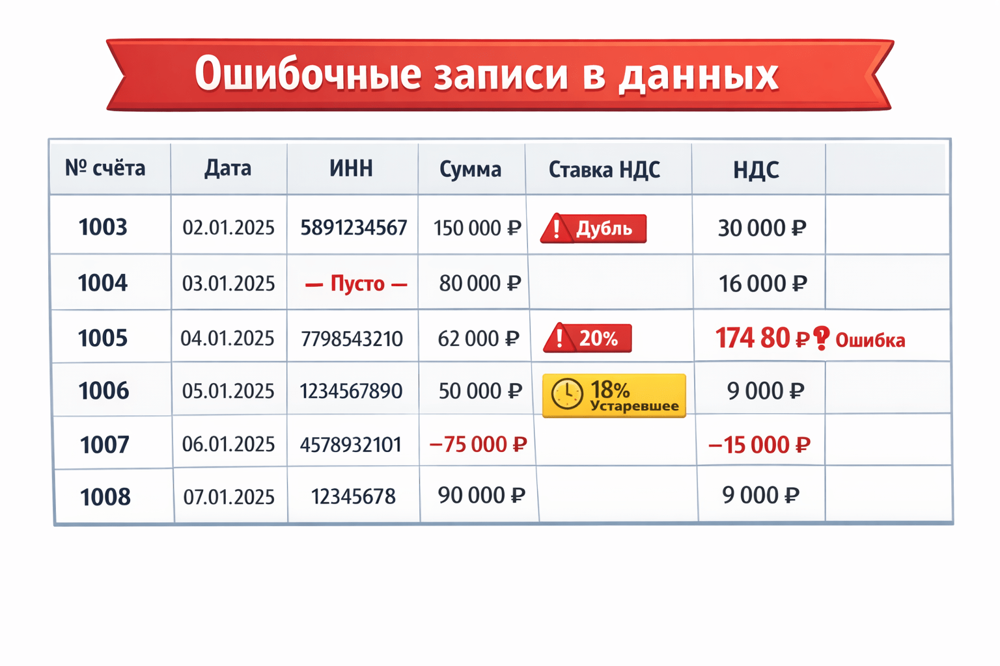
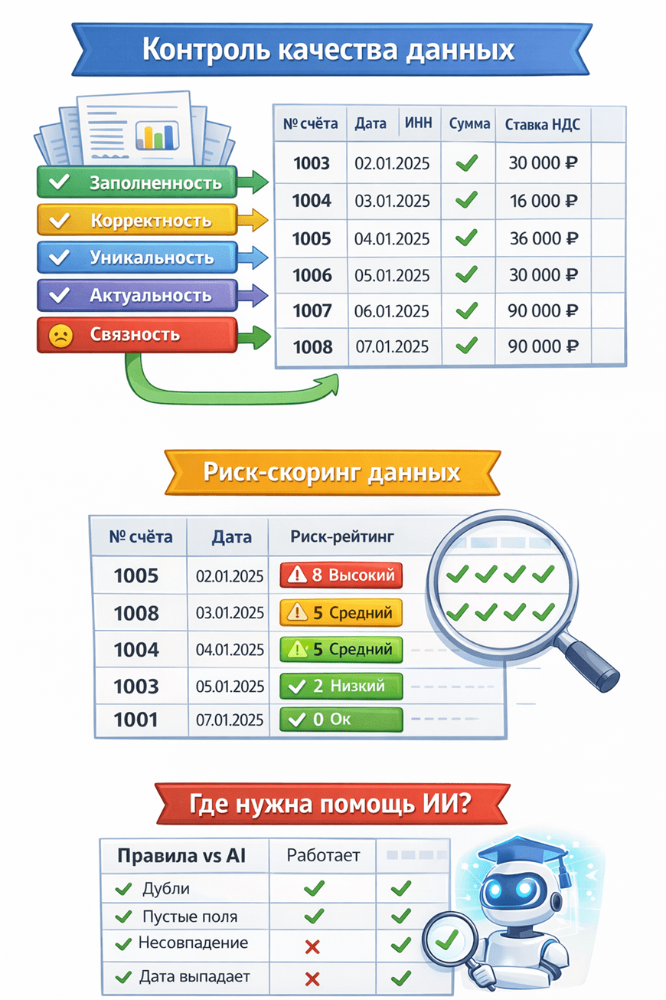

https://vc.ru/ai/2664412-proverka-kachestva-dannyh-dlya-rascheta-nds

#НДС считают формулы. А проблемы — кривые данные: как построить достоверную проверку (и где тут уместен ИИ)
##Вычислить налог на добавленную стоимость несложно – ставка известна, формула элементарна. Тем не менее, бухгалтерские службы регулярно сталкиваются с «уточнёнками» и требованиями предоставить пояснения. Почему так происходит? Ответ прост: формула считает правильно, но считает не то. Ошибки заложены раньше – в исходных данных.

По оценке Gartner, проблемы с качеством данных в среднем обходятся компаниям в $12,9 млн ежегодно[1]. В случае НДС цена ошибки может выражаться не только в деньгах, но и во времени бухгалтеров, потраченном на перепроверки и переподачу деклараций, а также в повышенном внимании налоговой службы. В этой статье разберёмся, какие бывают дефекты данных при расчёте НДС, как построить многоуровневую систему проверки качества (за пару недель) и где действительно пригодятся методы ИИ.

Почему правильная формула не спасает

НДС = налоговая база * ставка. В России сейчас ставка 20%, для некоторых товаров – 10%, для экспорта – 0%. Казалось бы, всё просто: заложи формулу в 1С или Excel – и получай правильные суммы. Однако правильность формулы не гарантирует правильность НДС. Если в базе оказался дубль счёта-фактуры или опечатка в сумме, формула посчитает формально верно, но по сути – ерунду. В итоге отчётность уедет с ошибкой.

Пример: менеджер выписал счёт-фактуру на 100 тыс. ₽ + НДС 20 тыс. ₽. Документ дважды провели в системе. Формула в каждом случае корректно начислила 20% от базы – и компания в декларации отразила 40 тыс. ₽ вместо 20 тыс. ₽. Налоговая инспекция при проверке обнаружит расхождение (например, по встречным данным контрагента) – и организации придётся объясняться, платить штраф за завышенный вычет или подавать уточнёнку.

Другой случай – неполные или неверные сведения. Если не указан ИНН покупателя или стоит некорректная ставка налога, счёт-фактура может считаться недействительной. Даже при верных суммах НДС компания рискует потерять вычет или получить требование пояснить несоответствия.

Формула расчёта здесь не при чём – сбой произошёл до неё, на этапе ввода или загрузки данных. Значит, и решать проблему нужно до расчёта. Требуется контур проверок качества данных, который автоматически выявит ошибки и предупредит о них ответственных ещё до формирования декларации. Рассмотрим, какие виды ошибок встречаются чаще всего.

Откуда берутся кривые данные

Основные проблемы: дубли, пропущенные значения, неконсистентные форматы, устаревшие данные. Это может привести к ошибкам в аналитике, неверным бизнес‑решениям и снижению доверия к системе[2].

Перечислим типичные дефекты исходных данных, влияющие на расчёт НДС, – для каждого разберёмся, как выглядит симптом, в чём причина, к чему приводит и как обнаружить.

*Рисунок 1

НДС считают формулы. А проблемы — кривые данные: как построить достоверную проверку (и где тут уместен ИИ)
Дубликаты записей

Признак: один и тот же счёт-фактура заведён дважды (совпадают номер, дата, суммы и пр.). Причина: человеческий фактор (повторный ввод вручную, задвоение при импорти из разных систем) или сбой интеграции. Риск: двойной учёт суммы и налога. В отчётности НДС завышен, возможен лишний платёж или завышенный вычет – в любом случае, искажение налоговых обязательств. Вероятны уточнённая декларация и пристальное внимание инспектора. Как отловить: настроить уникальный ключ (например, совокупность: номер + дата + контрагент) в базе – дубли просто не загрузятся. Если это невозможно, то регулярный SQL-запрос с GROUP BY на ключевые поля и COUNT(*) > 1 выделит подозрительные повторения.

Пропуски обязательных полей

Признак: в строке отсутствует критическое значение – например, пустой ИНН контрагента, не указана ставка НДС или сумма документа. Причина: недостающие данные в исходном источнике, некорректный парсинг файла, неправильный формат обмена (поле не совпало по имени и не загрузилось). Риск: если нет ИНН, налоговая не сможет сопоставить счет-фактуру с покупателем/продавцом; если не указана ставка, непонятно, как рассчитан налог. Такие записи могут «зависнуть» при обработке, потребовать ручного запроса данных или вообще выпасть из декларации. Это чревато ошибками и штрафами за некорректные сведения. Как отловить: простейший контроль на полноту данных. В SQL-представлении: WHERE INN IS NULL OR INN = '' – выберет все пустые ИНН. Аналогично для других обязательных полей. В датафрейме Pandas – df[df['INN'].isna()]. Эти записи должны либо обогащаться недостающими данными, либо блокироваться от дальнейшего расчёта до выяснения.

Неверный формат или тип данных

Признак: поля заполнены, но «не тем»: в числовом поле текст, в ИНН лишние символы или неподходящее количество цифр, дата в неверном формате (например, строкой без распознавания). Причина: ошибки ввода (буква в месте цифры), различие форматов между системами (одна система выгружает дату как ДД/ММ/ГГГГ, а парсер ждёт ГГГГ-ММ-ДД), нарушения договорённостей по структуре данных. Риск: подобные записи могут не загрузиться в целевую систему расчёта НДС (если схема БД жёстко типизирована) или, что хуже, загрузятся, но будут некорректно интерпретированы. Например, ИНН 12345678O9 (с буквой O вместо нуля) формально строка нужной длины, но не соответствует реальному ИНН – в результате счет-фактура может не засчитаться контролерами ФНС. Как отловить: проверки валидности на этапе приема данных. Регулярные выражения для строк (ИНН – 10 или 12 цифр, без букв), контроль допустимых символов, явное задание форматов дат при импорте. Инструменты: CHECK-ограничения в БД, скрипты на Python (например, метод .str.match() в Pandas или схемы данных через Pandera).

Устаревшие справочники и параметры

Признак: в данных используются значения, которые не актуальны на текущую дату. Например, ставка НДС 18% в документе 2025 года (хотя после 2019 г. базовая ставка 20%). Или устаревший код вида операции, не действующий в текущем периоде. Причина: несовмещённость временных версий данных – документ мог сформироваться раньше изменения ставки, затем попасть в обработку позднее; либо в системе не обновили справочник ставок/кодов; либо ошибка пользователя (выбрал не ту ставку из списка). Риск: расчёт налога будет неверным (18% вместо 20% – недоимка, 0% вместо 20% – серьёзная недоплата, грозящая штрафами). Даже если суммы пересчитали правильно, декларация не примет некорректный код или старое значение – придется подавать уточнение. Как отловить: контроль актуальности справочников. Проще всего – проверять допустимые значения через условие (WHERE VATRate NOT IN ('0%', '10%', '20%')). Если такие записи находятся, дальше анализировать датой: к примеру, может потребоваться разделять обработку документов до и после даты изменения ставки. В общем случае полезны справочники с версиями по дате, и проверка “дата документа – ставка НДС” на соответствие друг другу.

Математические несостыковки

Признак: сумма НДС не соответствует базе и ставке. Например, в строке базы указано 1000 ₽, ставка 20%, а НДС стоит 250 ₽ (вместо 200). Или сумма счёта-фактуры не равна сумме позиций. Причина: ошибка расчёта (человеческая или сбой округления), ручная правка суммы без согласования с остальными полями, неправильные единицы (например, указали сумму с НДС, а ставка применилась ещё раз сверху). Также бывает при конвертации валют – курсовые разницы, если неправильно учесть, могут давать расхождения. Риск: несоответствие контрольным соотношениям. ФНС автоматически проверяет, что сумма налога = база ставка. Если нет – декларация либо не сойдётся по разделам, либо вызовет вопросы на камеральной проверке. Итог – запрос пояснений, исправление и возможно штраф, если ошибка повлияла на сумму налога. Как отловить: повторным пересчётом и сравнением. В SQL это выражается условием вроде WHERE VAT <> Amount 0.2 (для 20%) с допущением на округления (ABS(VAT - ROUND(Amount*0.2, 2)) > 0.01). В Pandas аналогично: df[abs(df['VAT'] - df['Amount']*df['VATRateValue']) > tol]. Такие проверки стоит делать для каждой ставки (0% -> налог должен быть 0, 10% и 20% пересчитывать).

Аномальные значения

Признак: данные сильно отклоняются от ожидаемых по величине или признакам. Примеры: отрицательная сумма счета (–100 ₽), очень большой налог (> млн ₽ на одну позицию), нетипичная ставка (например, 7% – не существует для НДС). Причина: отрицательные суммы могут появляться из-за возвратов/сторно, но тогда обычно оформляются отдельными документами (корректировочными). Если же в обычном наборе обнаружен минус – вероятно, ошибочно проставлен знак. Чрезмерно большие значения могут указывать на сбой формирования (например, цены в копейках вместо рублей, «сдвиг запятой»). В нетипичных значениях – просто ошибка ввода. Риск: аномалии либо вызовут вопросы у проверяющих (“почему отрицательная база?”), либо укажут на серьёзную проблему в учёте (неправильные единицы измерения дадут неверный налог на порядок). В любом случае их надо расследовать и исправлять. Как отловить: правдоподобность данных – более сложный слой контроля. Простые правила: сумма не должна быть отрицательной (если только не отдельный тип корректировки), налог не может превышать базу (при ставке <=100%), ставка должна быть из фиксированного перечня. Эти правила можно явно задать. С выявлением тонких аномалий помогает статистика: например, сравнение распределений, поиск выбросов (outliers) – тут уже могут пригодиться методы машинного обучения (об этом далее).

5 слоёв контроля

Для обеспечения качества данных на практике используют несколько уровней проверок. Вот пять ключевых измерений Data Quality[3], применимых к нашим финансовым данным:

· Полнота (Completeness) – все обязательные данные присутствуют. Например, во всех строках должны быть указаны ИНН, дата, сумма и ставка. Если чего-то нет – данные неполны.

· Валидность (Validity) – данные соответствуют заданным правилам и форматам. Например, ИНН должен быть 10-значным числом, ставка НДС – из перечня {0%, 10%, 20%}, дата – в допустимом формате. Валидные данные — это структурно корректные данные.

· Уникальность (Uniqueness) – нет дубликатов там, где их быть не должно. Каждый счёт-фактура должен существовать в единственном экземпляре. Если один и тот же номер встречается дважды – нарушена уникальность.

· Согласованность (Consistency) – данные не противоречат друг другу по смыслу. Суммы и ставки соответствуют начисленному налогу, позиции счета-фактуры суммируются в итоги без расхождений. Также согласованность подразумевает отсутствие противоречий между разными источниками (если сравниваем, например, книги покупок и продаж).

· Актуальность (Timeliness) – данные обновлены и используются вовремя. Раз мы считаем НДС за текущий квартал, то должны применять текущие ставки и актуальные справочники. Все устаревшие или просроченные сведения (ставки, коды операций, статусы) должны быть идентифицированы и обновлены.

*Рисунок 2

НДС считают формулы. А проблемы — кривые данные: как построить достоверную проверку (и где тут уместен ИИ)
Схема уровней контроля качества данных и обработки НДС:

Каждый слой отвечает на свой набор вопросов. Реализуя проверки последовательно, мы как будто процеживаем сырые данные через серию фильтров:

[Исходные данные] ↓ [Полнота] → отсекаем пустые и неполные записи ↓ [Валидность] → отсекаем значения вне форматов/диапазонов ↓ [Уникальность] → устраняем дубли ↓ [Согласованность] → проверяем взаимосвязи (формулы, суммы) ↓ [Актуальность] → проверяем даты, версии справочников ↓ [Расчёт НДС формулами] ↓ [Формирование декларации]

На практике некоторые проверки можно выполнять параллельно, но концептуально полезно рассматривать их именно слоями. Сначала базовая техническая валидность данных, затем более сложные бизнес-правила. Например, нет смысла проверять соответствие сумм по ставке, если у записи вообще ставка не указана или формат поля неверный – сначала вычистим пропуски и опечатки.

Важно: внедряя многоуровневый контроль, определите ответственных за каждый тип ошибок. Одни проблемы может автоматически исправлять сама система (скажем, проставить текущую дату, если пусто). Другие требуют участия человека (уточнить ИНН у отдела продаж). Третьи просто пометить и ждать развития (документ из прошлого периода со старой ставкой – может, его не нужно включать в расчёт текущего периода). Система должна не только обнаруживать, но и эскалировать проблемы тем, кто их может решить.

Разработав набор правил для пяти слоёв, перейдём к реализации. Ниже приведён упрощённый пример пайплайна контроля качества данных.

Мини-пайплайн без маркетинга (ASCII-схема)

[ Получены данные ] ↓ [ Проверка полноты ] (есть ли все обязательные поля?) ↓ [ Проверка валидности ] (форматы, допустимые значения) ↓ [ Проверка уникальности ] (дубли записей) ↓ [ Проверка согласованности ] (формулы и бизнес-правила) ↓ [ Поиск аномалий ] (необычные отклонения, AI/ML) ↓ [ Расчёт НДС по формулам ] ↓ [ Отчётность и файлы на выгрузку ]

Такой конвейер встроен в процесс обработки перед расчётом. На выход на расчёт идут только чистые данные, а все выявленные проблемы фиксируются в отчёте. Например, можно сформировать таблицу ошибок: {ID документа, тип ошибки, описание} и регулярно отправлять ответственным лицам. Цель – добиться, чтобы к моменту расчёта и формирования налоговой декларации все исходные сведения были достоверны.

Конечно, степень автоматизации может быть разной. Маленькая компания может проверить экстренно данные вручную (в Excel-файле фильтрами). Но мы говорим об инженерном подходе – значит, будем писать скрипты и проверять машиной.

качеству данных. Например, число дублей, число пустых значений, число ошибок расчёта. В маленьком наборе, как у нас, всё можно увидеть глазами, а в большом отчёте такие агрегаты очень полезны.

В схеме мы указали, что ИНН – строка длиной 10 или 12 символов, ставка – одна из трёх допустимых, сумма неотрицательная, а также добавили наборную проверку (checks) на согласованность суммы НДС со ставкой. Если данные не соответствуют этим правилам, schema.validate выбросит понятное исключение с перечнем нарушений. Pandera не исправляет данные, но сразу покажет, где отклонения. Это удобно в сложных конвейерах: можно “падать” раньше, чем ошибочные данные уйдут дальше[5][6].

Конечно, Pandera – лишь одна из библиотек. Существует и Great Expectations, и другие фреймворки для валидации данных. Но часто достаточно и простых скриптов на Pandas или SQL-запросов. Выбор инструмента зависит от масштаба задачи и уже имеющейся инфраструктуры. Главное – заложить необходимый контур проверки.

Риск-скоринг данных

Ещё один практичный приём – оценка риска по данным. Идея в том, чтобы каждой записи (или документу) присвоить балл в зависимости от количества/типа найденных проблем. Например, счёт-фактура без ИНН и с неверной суммой НДС получит высокий риск, а документ с единственной округлительной разницей – низкий.

Конечно, шкалу баллов каждая команда выбирает под себя, можно учитывать и веса (например, отсутствие ИНН – критично, вес 5; дубли – тоже 5; небольшие расхождения – 1). Ценность скоринга в том, что он агрегирует много сигналов в одном числе, упрощая принятие решения, куда бросить усилия сначала.

После очистки и исправления выявленных проблем, данные выглядят консистентно. Вернёмся к нашему примеру и посмотрим, как станет выглядеть фрагмент таблицы после очистки:

Где помогает ИИ: - Поиск неявных аномалий. Алгоритмы машинного обучения (Isolation Forest, One-Class SVM и др.) хорошо ловят выбивающиеся из общей картины данные[7][8]. Например, выявят странно низкие/высокие суммы счетов по сравнению со средним, или нетипичное поведение (вдруг в одном документе одновременно применены две разные ставки – редкий случай). - Дедупликация. ИИ (кластеризация, NLP) поможет сопоставить дубли, если они не точные. Например, два контрагента "ООО Ромашка" и "ООО Ромашка." – для машины это разные строки, а для человека один и тот же. Модель может научиться вычислять, что это дубль, несмотря на отличия в написании[9][10]. Для счетов-фактур это актуально, если номера вводят вручную с вариациями (№123 vs 123/2023 и т.п.). - Предсказание пропущенных значений. Когда данных не хватает, AI может попытаться предсказать их на основе похожих случаев[11][12]. Например, угадать ставку налога по описанию товара (требует обучить модель на исторических данных) или заполнить вероятный ИНН по наименованию компании (если есть справочник). Это рискованно, но иногда полезно для предварительной автоматической правки с последующей ручной проверкой. - Приоритизация и кластеризация ошибок. Машинное обучение может обработать миллионы записей и сгруппировать проблемы по схожести. Например, выдать, что 80% ошибок – это отсутствие ИНН в филиале X (значит, сбой интеграции там), а остальные 20% – что-то уникальное. Это помогает фокусироваться на системных сбоях. Также модели могут прогнозировать, какие документы с ошибками с большей вероятностью приведут к штрафам, и подсказывать, что сначала чинить.

Где ИИ не нужен: - Очевидные проверки проще закодировать. Не стоит городить нейросеть, чтобы проверить длину ИНН или посчитать 20% от суммы. Чёткие правила (регулярки, арифметика) выполняются мгновенно и безошибочно, здесь ИИ только усложнит решение. Наши примеры с SQL/Pandas – именно такие случаи. - Ограниченный объём данных. Если у вас 500 документов в месяц, визуально просмотреть отчёт о паре-тройке аномалий не составит труда. ИИ оправдан, когда данных очень много и глазом не схватить все взаимосвязи. - Нет обучающей выборки. Чтобы ИИ отличал норму от отклонения, его надо самому научить или хотя бы показать достаточно данных. Если у компании небольшой архив счетов, алгоритм anomaly detection может как раз не справиться (слишком мало примеров). Здесь лучше задать пороговые правила вручную, основываясь на экспертном знании. - Высокие требования к интерпретации. Результат правил – легко объясним: “запись не прошла, потому что в поле X пусто”. Результат работы ML-модели – “анномалия с оценкой 95%” – и дальше разбирайся почему. Для налогового учёта критично уметь обосновать каждую правку. Если ваш AI-инструмент не дает прозрачного объяснения, инспекция его доводы не примет. - Время и ресурс на внедрение. Подготовить и протестировать даже небольшой ML-модуль сложнее, чем написать пять SQL запросов. Если проект ограничен по срокам (например, нужно успеть до начала следующего квартала), ставьте в первую очередь детерминированные проверки. Вы всегда сможете добавить нейросетей потом, когда базовый каркас уже работает.

Стоит подчеркнуть: ИИ – это не волшебная палочка. Он не исправит бардак, если нет базовых правил. Лучше начать с простого – навести порядок очевидными методами, а уже затем подключать ML, чтобы добить тонкие моменты. Как образно сказал один инженер по данным: “Сначала научитесь находить иголку в стоге сена с помощью магнита (правила), а потом уже зовите экстрасенса (AI) для поисков тех иголок, которые магнит не берёт.”