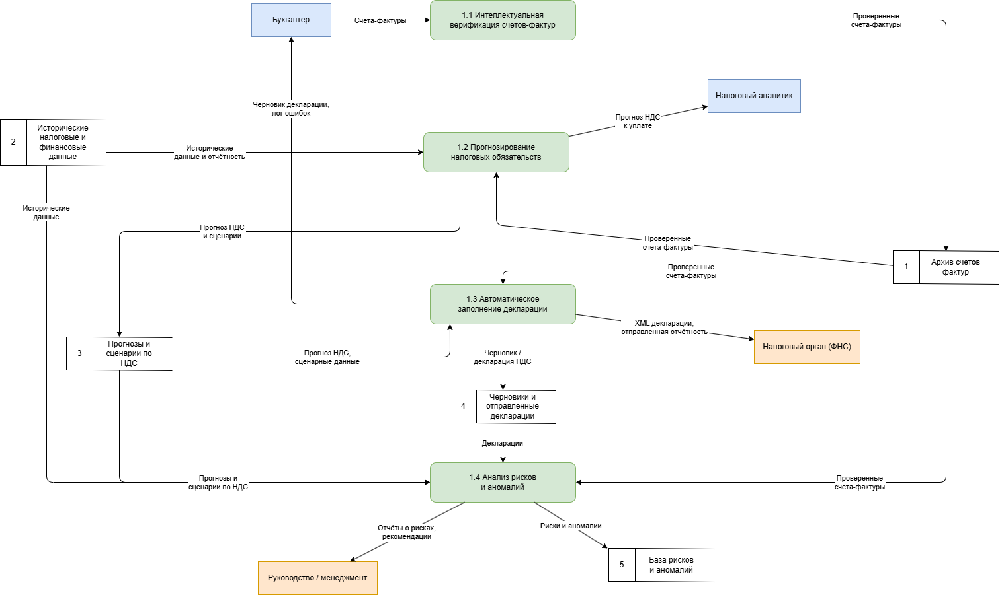

# DFD Диаграмма потоков данных

В данном приложении представлена диаграмма потоков данных (Data Flow Diagram, DFD),
описывающая движение данных внутри системы автоматизированного анализа НДС
с использованием искусственного интеллекта.

DFD-диаграмма отражает основные источники данных, процессы обработки,
хранилища данных и внешние сущности, а также информационные потоки между ними.

---

## Общая диаграмма потоков данных

  
**DFD.** Диаграмма потоков данных системы автоматизированного анализа НДС
